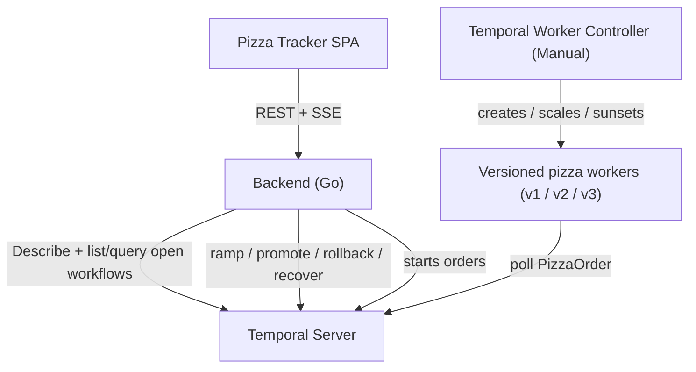

# temporal-versioning-demo

A customer-facing demo of Temporal **Worker Versioning** on
Kubernetes. A live **Pizza Tracker** dashboard shows pizza
orders flowing through their stages, colour-coded by the
worker version handling them — making safe worker deploys
visible: in-flight orders stay pinned, new orders ramp onto
the new version, and a bad release is rolled back and
recovered with zero non-determinism errors.

[][ci]
[](LICENSE)

[ci]: https://github.com/alexandreroman/temporal-versioning-demo/actions

> [!WARNING]
> This project is for **demonstration, testing and
> development** only. It targets a local Kind cluster, runs
> the Temporal frontend in plaintext (no TLS / API key), and
> is not production-ready.

## What it demonstrates

Temporal Worker Versioning lets you ship new worker code
without breaking running workflows. This demo makes each
guarantee visible on a live dashboard:

- **Pinned in-flight orders** — every order keeps running on
  the worker version it started on. Deploying or ramping a
  new version never changes the shape of an order already in
  flight.
- **Canary ramp** — shift a percentage of *new* orders onto a
  new version straight from the UI (10% → 25% → 50% → 100%),
  then promote it to Current for a full cutover.
- **Instant rollback** — drop a bad version's ramp in one
  click; new orders snap back to the Current version and the
  blast radius stays capped at the canary slice.
- **Reset-with-move recovery** — rewind the orders stuck on a
  bad build and re-run them, pinned to the healthy version,
  from the start.
- **Zero non-determinism** — because every version is Pinned
  and recovery re-pins to a known-good build, no order ever
  replays against incompatible code.

## The three versions

A single worker image compiles all three pizza-workflow
shapes. The `PIZZA_VERSION` env var selects which shape a pod
registers (under the shared workflow type `PizzaOrder`); all
shapes are **Pinned**.

| Version | Pipeline                                                          | Notes                       |
| ------- | ----------------------------------------------------------------- | --------------------------- |
| `v1`    | Received → Cooking → Out for delivery → Delivered                 | Baseline, 4 steps.          |
| `v2`    | Received → Cooking → Quality check → Out for delivery → Delivered | Adds a Quality check step.  |
| `v3`    | Received → Cooking → Quality check → Drone delivery → Delivered   | Drone always fails; stalls. |

`v3` is intentionally buggy: its Drone delivery activity
always errors, so v3 orders enter a bounded retry loop, go
red, and stall until they are recovered onto the healthy
version.

## Architecture



- **Browser SPA** — a single-page Pizza Tracker. It receives
  live `DashboardState` frames over **Server-Sent Events**
  (`GET /events`) and drives rollout actions through **REST**
  (`POST /api/ramp`, `/api/promote`, `/api/rollback`,
  `/api/recover`).
- **Go backend** (`cmd/backend`) — polls Temporal
  (`DescribeWorkerDeployment` for routing config and version
  summaries, plus lists and `getState`-queries the open
  `PizzaOrder` workflows), serves the SPA, drives the routing
  and recovery actions, and runs an order generator that
  starts one order every few seconds so there is always live
  traffic. Each worker reports its friendly version
  (`v1`/`v2`/`v3`) and step progress through the **`getState`
  query**, so the UI colours orders without decoding Build
  IDs.
- **Temporal Server + Worker Controller** — the controller
  runs in **Manual** strategy and manages the versioned
  worker pods. One image compiles all three workflow shapes;
  the shape is selected per pod by the `PIZZA_VERSION` env
  var. The controller derives a Build ID from the
  pod-template hash, so shipping a new version is just a
  pod-template change (new `PIZZA_VERSION` and/or image tag).

Routing actions map to the Temporal API as follows: ramp →
`SetRampingVersion`, promote → `SetCurrentVersion`, rollback →
`SetRampingVersion` with an empty build ID (safe because a
Current version is set), and recover → a per-order
reset-with-move that re-pins each stuck order to the Current
build.

| Module           | Description                                          |
| ---------------- | ---------------------------------------------------- |
| `cmd/worker`     | Versioned Temporal worker (Pinned behaviour).        |
| `cmd/backend`    | REST + SSE API, state poller, actions, generator.    |
| `internal/pizza` | Pizza workflows, activities and shared types.        |
| `internal/dashboard` | State model, poller, actions, SSE hub, server.   |
| `frontend`       | Single-page Pizza Tracker dashboard.                 |
| `k8s`            | Kustomize manifests for the demo deployment.         |

## Prerequisites

- A running [temporal-k8s](https://github.com/alexandreroman/temporal-k8s)
  Kind cluster (Temporal Server + Temporal Worker
  Controller).
- [Go](https://go.dev/) 1.26+
- [GNU Make](https://www.gnu.org/software/make/)
- [kubectl](https://kubernetes.io/docs/tasks/tools/) and
  [Docker](https://www.docker.com/). The local stack uses
  Docker Compose v2 (`docker compose`).

## Build & run

```bash
git clone https://github.com/alexandreroman/temporal-versioning-demo.git
cd temporal-versioning-demo

make build   # build the worker and backend binaries
make test    # run the tests (go test -race -shuffle=on ./...)
make lint    # run golangci-lint (requires golangci-lint v2)
```

Run `make help` to list every target grouped by section.

### Run locally without Kubernetes

You can run the whole demo on your machine without a cluster.
Both flows below start a Temporal dev server in Docker via
Compose, so no `temporal-k8s` cluster is required.

In both cases the Worker Controller and its **Manual**
strategy are not in play locally, so **no Current version is
set initially and no orders flow** until you promote v1.
Click **Promote** in the UI, or run the
`temporal worker deployment set-current-version` CLI shown in
[Deploy to the temporal-k8s cluster](#deploy-to-the-temporal-k8s-cluster).

**Host hot-reload flow** — runs the backend and worker on the
host with hot reload, ideal for iterating on code:

```bash
make dev   # starts Temporal in Docker, then backend + worker v1 on the host
```

During the demo, ship the next versions by running extra
workers in separate terminals:

```bash
make worker-v2   # ship v2
make worker-v3   # ship v3
```

The Temporal Web UI is at <http://localhost:8233> and the
Pizza Tracker dashboard at <http://localhost:8080>.

**Full Docker flow** — builds and runs every component in
containers:

```bash
make app-up   # builds and starts Temporal + backend + worker v1
```

During the demo, ship the next versions via Compose profiles:

```bash
docker compose --profile v2 up -d   # ship v2
docker compose --profile v3 up -d   # ship v3
```

Tear the stack down with:

```bash
make app-down
```

Container images are published to ghcr.io by CI:

- `ghcr.io/alexandreroman/temporal-versioning-demo-worker`
- `ghcr.io/alexandreroman/temporal-versioning-demo-backend`

## Deploy to the temporal-k8s cluster

Apply the Kustomize manifests against the running cluster
(images are pulled from ghcr.io):

```bash
kubectl apply -k k8s/
```

For convenience, `make deploy` runs `kubectl apply -k k8s/`
and `make teardown` runs `kubectl delete -k k8s/`. Unlike the
local-dev targets, these ignore `.env.local` and run against
the host environment unchanged.

Because the Worker Controller runs in **Manual** strategy, the
first version starts **Inactive** with no Current version, so
no orders flow yet. Promote v1 to Current to start the order
flow — click **Promote** in the UI, or use the CLI:

```bash
# Get the build id, then promote it:
temporal worker deployment describe --deployment-name default.pizza
temporal worker deployment set-current-version \
  --deployment-name default.pizza --build-id <v1-build-id>
```

The dashboard is then available at
<http://pizza.127-0-0-1.nip.io/>.

## Demo script

The on-stage flow that exercises every guarantee:

1. **Steady state on v1.** Orders stream in on v1 (4 steps).
   The KPI strip shows Current `v1`.
2. **Ship v2.** Set `PIZZA_VERSION: v2` in
   `k8s/workerdeployment.yaml` (optionally bump the image
   tag) and `kubectl apply -k k8s/`. Wait for the v2 pod.
3. **Ramp v2.** In the UI, ramp 10% → 50% → 100%, then
   **Promote**. In-flight v1 orders keep their 4-step journey
   (pinned); new orders show the 5-step v2 pipeline with the
   Quality check. v1 drains and is sunset by the controller.
4. **Ship v3 and ramp to 10%.** Set `PIZZA_VERSION: v3`,
   apply, wait for the pod, then ramp v3 to 10%. About 10% of
   new orders reach the Drone step, go **red** with a retry
   count, and stall. v2 orders are unaffected.
5. **Rollback.** Click **Rollback**. The ramp drops to 0 and
   100% of new orders go to v2 again. The already-stuck v3
   orders stay red — rollback caps the blast radius but does
   not heal them.
6. **Recover stuck orders.** Click **Recover stuck orders**.
   Each stuck v3 order is reset-with-moved onto v2: it
   restarts from Received, pinned to the healthy build, and
   completes cleanly. Once none remain, v3 drains and is
   sunset.

## Caveat: CRD naming

The `temporal-k8s` cluster runs Temporal Worker Controller
chart **≥ 0.26.0**, which **renamed** the controller CRDs and
no longer reconciles the old kinds. The manifests in `k8s/`
therefore use:

- `kind: WorkerDeployment` (not `TemporalWorkerDeployment`)
- `kind: Connection` (not `TemporalConnection`)

Both stay on API group/version `temporal.io/v1alpha1`; the
field layout is otherwise identical. Verify what your cluster
actually has before applying:

```bash
kubectl get crd | grep -i temporal
```

If, surprisingly, only the legacy `temporalworkerdeployments`
CRD exists, switch the manifests back to the old kinds — the
fields are the same.

## Configuration

The worker reads:

| Variable                   | Description                             | Default          |
| -------------------------- | --------------------------------------- | ---------------- |
| `TEMPORAL_ADDRESS`         | Temporal frontend gRPC address          | `localhost:7233` |
| `TEMPORAL_NAMESPACE`       | Temporal namespace                      | `default`        |
| `TEMPORAL_DEPLOYMENT_NAME` | Worker Deployment name (controller)     | (required)       |
| `TEMPORAL_WORKER_BUILD_ID` | Worker Build ID (controller)            | (required)       |
| `PIZZA_VERSION`            | Workflow shape this pod runs (v1/v2/v3) | `v1`             |
| `PIZZA_TASK_QUEUE`         | Task queue polled by the worker         | `pizza`          |

The backend reads:

| Variable                | Description                          | Default          |
| ----------------------- | ------------------------------------ | ---------------- |
| `TEMPORAL_ADDRESS`      | Temporal frontend gRPC address       | `localhost:7233` |
| `TEMPORAL_NAMESPACE`    | Temporal namespace                   | `default`        |
| `PIZZA_DEPLOYMENT_NAME` | Worker Deployment name to describe   | `default.pizza`  |
| `PIZZA_TASK_QUEUE`      | Task queue orders are started on     | `pizza`          |
| `PIZZA_POLL_INTERVAL`   | Temporal poll cadence                | `1s`             |
| `PIZZA_ORDER_INTERVAL`  | New-order cadence                    | `6s`             |
| `PORT`                  | HTTP listen port                     | `8080`           |
| `FRONTEND_DIR`          | Directory served as the SPA          | `frontend`       |

> The controller auto-injects `TEMPORAL_ADDRESS`,
> `TEMPORAL_NAMESPACE`, `TEMPORAL_DEPLOYMENT_NAME` and
> `TEMPORAL_WORKER_BUILD_ID` into the worker pods, so the
> `k8s/workerdeployment.yaml` pod template only sets
> `PIZZA_VERSION`.

## License

This project is licensed under the Apache-2.0 License — see
[LICENSE](LICENSE) for details.
</content>
</invoke>
