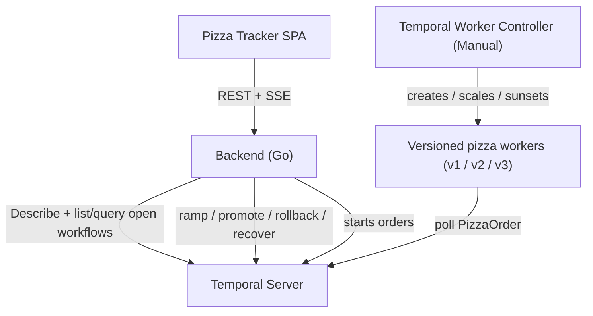

# Temporal Versioning Demo

A customer-facing demo of Temporal **Worker Versioning** on
Kubernetes. A live **Pizza Tracker** dashboard shows pizza
orders flowing through their stages, colour-coded by the
worker version handling them — making safe worker deploys
visible: in-flight orders stay pinned, new orders ramp onto
the new version, and a bad release is rolled back and
recovered with zero non-determinism errors.

[][ci]
[](LICENSE)

[ci]: https://github.com/alexandreroman/temporal-versioning-demo/actions

> [!WARNING]
> This project is for **demonstration, testing and
> development** only. It targets a local Kind cluster, runs
> the Temporal frontend in plaintext (no TLS / API key), and
> is not production-ready.

## What it demonstrates

Temporal Worker Versioning lets you ship new worker code
without breaking running workflows. This demo makes each
guarantee visible on a live dashboard:

- **Pinned in-flight orders** — every order keeps running on
  the worker version it started on. Deploying or ramping a
  new version never changes the shape of an order already in
  flight.
- **Canary ramp** — shift a percentage of *new* orders onto a
  new version straight from the UI (25% → 50% → 100%),
  then promote it to Current for a full cutover.
- **Instant rollback** — drop a bad version's ramp in one
  click; new orders snap back to the Current version and the
  blast radius stays capped at the canary slice.
- **Reset-with-move recovery** — rewind the orders stuck on a
  bad build and re-run them, pinned to the healthy version,
  from the start.
- **Zero non-determinism** — because every version is Pinned
  and recovery re-pins to a known-good build, no order ever
  replays against incompatible code.

## The three versions

The worker binary compiles all three pizza-workflow shapes, but
it is published as **three version-tagged images**
(`:v1`/`:v2`/`:v3`): the active shape is baked at build time via
the `PIZZA_VERSION` build arg, so each pod registers exactly one
shape (under the shared workflow type `PizzaOrder`); all shapes
are **Pinned**. (Local dev and Compose still pick a shape at
runtime via a `PIZZA_VERSION` env var, which overrides the baked
default.)

| Version | Pipeline                                                          | Notes                       |
| ------- | ----------------------------------------------------------------- | --------------------------- |
| `v1`    | Received → Cooking → Out for delivery → Delivered                 | Baseline, 4 steps.          |
| `v2`    | Received → Cooking → Quality check → Out for delivery → Delivered | Adds a Quality check step.  |
| `v3`    | Received → Cooking → Quality check → Drone delivery → Delivered   | Drone always fails; stalls. |

`v3` is intentionally buggy: its Drone delivery activity
always errors, so v3 orders retry forever via Temporal's
native durable retry, go red, and stall (Running) until they
are recovered onto the healthy version — they never
fail/complete.

## Architecture



- **Browser SPA** — a single-page Pizza Tracker built with
  **HTMX** and **Tailwind CSS** (both via CDN, no build step).
  The backend renders the dashboard server-side from each
  `DashboardState` and pushes the HTML fragments over
  **Server-Sent Events** (`GET /events`); HTMX swaps them into
  the page. Rollout actions are driven through **hypermedia
  endpoints** that return server-rendered **HTML fragments**
  (not JSON), so they deliberately live off the `/api/` prefix:
  `POST /deploy` (ramp or promote), `POST /rollback`, and
  `POST /orders/{id}/recover`. Their modal fragments are served
  by `GET /deploy` and `GET /rollback` and dismissed with
  `DELETE /modal`. The SPA (`index.html`) is embedded into the
  backend binary.
- **Go backend** (`cmd/backend`) — polls Temporal
  (`DescribeWorkerDeployment` for routing config and version
  summaries, plus lists and `getState`-queries the open
  `PizzaOrder` workflows), serves the SPA, drives the routing
  and recovery actions, and runs an order generator that
  starts one order every few seconds so there is always live
  traffic. Each worker reports its friendly version
  (`v1`/`v2`/`v3`) and step progress through the **`getState`
  query**, so the UI colours orders without decoding Build
  IDs.
- **Temporal Server + Worker Controller** — the controller
  runs in **Manual** strategy and manages the versioned
  worker pods. The worker binary compiles all three workflow
  shapes, but each image bakes one shape at build time, so the
  worker is published as three version-tagged images
  (`:v1`/`:v2`/`:v3`). The controller derives a Build ID from
  the pod-template hash, so shipping a new version is just a
  pod-template change — repointing the image tag to `:v2`/`:v3`.

Routing actions map to the Temporal API as follows: ramp →
`SetRampingVersion`, promote → `SetCurrentVersion`, rollback →
`SetRampingVersion` with an empty build ID (safe because a
Current version is set), and recover → a per-order
reset-with-move that re-pins each stuck order to the Current
build.

| Module           | Description                                          |
| ---------------- | ---------------------------------------------------- |
| `cmd/worker`     | Versioned Temporal worker (Pinned behaviour).        |
| `cmd/backend`    | REST + SSE API, state poller, actions, generator.    |
| `internal/pizza` | Pizza workflows, activities and shared types.        |
| `internal/dashboard` | State model, poller, actions, SSE hub, server.   |
| `frontend`       | Single-page Pizza Tracker dashboard.                 |
| `k8s/base`       | Kustomize base manifests for the demo deployment.    |
| `k8s/v2`, `k8s/v3` | Version overlays that ship the v2/v3 worker.       |

## Prerequisites

- A running [temporal-k8s](https://github.com/alexandreroman/temporal-k8s)
  Kind cluster (Temporal Server + Temporal Worker
  Controller).
- [Go](https://go.dev/) 1.26+
- [GNU Make](https://www.gnu.org/software/make/)
- [kubectl](https://kubernetes.io/docs/tasks/tools/) and
  [Docker](https://www.docker.com/). The local stack uses
  Docker Compose v2 (`docker compose`).
- [kbld](https://carvel.dev/kbld/) (Carvel) — `make deploy`
  uses it to pin image tags to immutable `sha256` digests
  before applying, so each worker Build ID maps to exactly one
  image (see [Why pin images to
  digests?](#why-pin-images-to-digests)). Install with
  `brew install kbld` or follow the [kbld install
  docs](https://carvel.dev/kbld/docs/latest/install/).

## Build & run

```bash
git clone https://github.com/alexandreroman/temporal-versioning-demo.git
cd temporal-versioning-demo

make build   # build the worker and backend binaries
make test    # run the tests (go test -race -shuffle=on ./...)
make lint    # run golangci-lint (requires golangci-lint v2)
```

Run `make help` to list every target grouped by section.

### Run locally without Kubernetes

You can run the whole demo on your machine without a cluster.
Both flows below start a Temporal dev server in Docker via
Compose, so no `temporal-k8s` cluster is required.

In both cases the Worker Controller and its **Manual**
strategy are not in play locally. The backend handles the
bootstrap instead: on startup it promotes the version a worker
has labelled **v1** in its Worker Deployment Version metadata,
and **waits** for that metadata before promoting (only when no
Current is set yet). Because it keys off the published label,
starting v1 / v2 / v3 together never promotes an arbitrary
build — orders always start flowing on v1, with no manual step.
Shipping and routing the later versions (v2 / v3) stays
manual — see the [Demo script](#demo-script).

**Host hot-reload flow** — runs the backend and worker on the
host with hot reload, ideal for iterating on code:

```bash
make dev   # Temporal in Docker + backend + workers v1/v2/v3 on the host
```

Because all three worker versions run at once, you can drive
arbitrary rollouts (ramp / promote any version) straight from
the dashboard, without starting workers on demand.

The Temporal Web UI is at <http://localhost:8233> and the
Pizza Tracker dashboard at <http://localhost:8090>, the Air
live-reload proxy. Edit Go code or `frontend/index.html` and
Air rebuilds the binary and refreshes the browser
automatically on every rebuild. The raw backend is still on
<http://localhost:8080> (no auto-reload) if you want to
bypass the proxy.

**Full Docker flow** — builds and runs every component in
containers:

```bash
make app-up   # builds and starts Temporal + backend + worker v1
```

During the demo, ship the next versions via Compose profiles:

```bash
docker compose --profile v2 up -d   # ship v2
docker compose --profile v3 up -d   # ship v3
```

Tear the stack down with:

```bash
make app-down
```

Container images are published to ghcr.io by CI:

- `ghcr.io/alexandreroman/temporal-versioning-demo-worker` —
  published under the immutable `:v1`/`:v2`/`:v3` tags (one per
  baked workflow shape; no `:latest`).
- `ghcr.io/alexandreroman/temporal-versioning-demo-backend` —
  unversioned, tagged with the commit `sha` plus `:latest`.

## Deploy to the temporal-k8s cluster

Deploy with `make deploy`, which renders the `k8s/base`
Kustomize set, resolves every image tag to its immutable
`sha256` digest with kbld, and applies the result:

```bash
make deploy     # install the demo (worker v1 + backend)
make teardown   # remove the demo from the cluster
```

Unlike the local-dev targets, `make deploy` and `make teardown`
ignore `.env.local` and run against the host environment
unchanged.

### What gets deployed

Everything lands in a dedicated `pizza-tracker` namespace (not
`default`), so add `-n pizza-tracker` to any `kubectl` command
that inspects the demo (e.g. `kubectl -n pizza-tracker get pods
-w`). The Kustomize set under `k8s/base` creates:

| Resource | Name | Role |
| -------- | ---- | ---- |
| `Namespace` | `pizza-tracker` | Isolates the demo from `default`. |
| `Connection` | `pizza-temporal` | Points the worker at the in-cluster Temporal frontend (`temporal-frontend.temporal.svc.cluster.local:7233`, plaintext). |
| `WorkerDeployment` | `pizza-worker` | Versioned worker, managed by the Worker Controller (Manual strategy). Registered in Temporal as `pizza-tracker/pizza-worker` (`<namespace>/<name>`). |
| `Deployment` + `Service` | `pizza-backend` | Dashboard backend (SSE + hypermedia API), served in-cluster on port 80. |
| `HTTPRoute` | `pizza-tracker` | Routes `pizza.127-0-0-1.nip.io` through the Traefik Gateway to the backend. |

Both pods run as non-root from distroless images with a
hardened `securityContext`, and their images are pinned to
digests (see [Why pin images to
digests?](#why-pin-images-to-digests)). On the temporal-k8s
Kind cluster the Traefik `web` listener is mapped to host port
80, so once deployed the dashboard is at
<http://pizza.127-0-0-1.nip.io/>.

### Shipping versions and rolling back

`make deploy` installs the v1 base from `k8s/base` (kbld
digest-pinned). Ship a later worker version to the running demo
with `make deploy-v2` or `make deploy-v3` (and `make deploy-v1`
to go back, which simply re-applies the v1 base). The v2/v3
targets apply a Kustomize overlay under `k8s/` — `k8s/v2` and
`k8s/v3`, sibling overlays of `k8s/base` (they reference the
base, not an ancestor, to avoid a kustomize ancestor-cycle) —
that references the base and repoints the `pizza-worker`
WorkerDeployment's container image to the immutable per-version
tag (`:v2`/`:v3`). Each tag bakes its own workflow shape, so the
pod-template change yields a new Build ID. The overlay output is
digest-pinned through kbld at apply time, exactly like the base:

```bash
make deploy-v2   # ship v2
make deploy-v3   # ship v3
make deploy-v1   # roll back to the v1 base
```

Run `make deploy` once first to create the demo.

Shipping a version only **registers** it; routing it is a
separate, manual step from the UI (ramp / promote / rollback —
see the [Demo script](#demo-script)). When a version stops
being Current it starts draining; the Worker Controller keeps
its pods for `sunset.scaledownDelay` (**30m**) so you can still
roll back to it onto live workers, then removes the version
after `deleteDelay` (**2h**).

### Bootstrapping the first version

The Worker Controller runs in **Manual** strategy, so it never
sets a Current version on its own. The backend bootstraps the
first version instead: on startup it promotes the version a
worker has labelled **v1** in its Worker Deployment Version
metadata, and **waits** for that metadata before promoting
(only when no Current is set yet). Keying off the published
label means starting v1 / v2 / v3 together never promotes an
arbitrary build — orders start flowing on v1 as soon as its
worker registers, with no manual promote.

### Driving rollouts from the CLI

The Deploy modal's ramp / promote / rollback actions map to
`temporal worker deployment` commands, so you can drive the same
rollout from a terminal instead of the UI.

The cluster exposes Temporal's gRPC API through the Traefik
Gateway, keyed on the `temporal.127-0-0-1.nip.io` hostname, so the
CLI's default `127.0.0.1:7233` returns a 404. Point the CLI at
that host (it also resolves to 127.0.0.1) for every command below:

```bash
export TEMPORAL_ADDRESS=temporal.127-0-0-1.nip.io:7233
```

Read the registered Build IDs — note `describe` takes `--name`,
while the `set-*` commands take `--deployment-name`:

```bash
temporal worker deployment describe --name pizza-tracker/pizza-worker
```

`describe` shows opaque Build IDs, not the friendly `v1`/`v2`/`v3`
labels — those live in each version's `pizzaVersion` metadata,
published by the worker and read with `describe-version`. To list
every Build ID with its version label:

```bash
DN=pizza-tracker/pizza-worker
temporal worker deployment describe --name "$DN" -o json \
  | jq -r '.versionSummaries[].BuildID' \
  | while read -r b; do
      v=$(temporal worker deployment describe-version \
            --deployment-name "$DN" --build-id "$b" -o json \
          | jq -r '.metadata.pizzaVersion.data | @base64d | fromjson')
      echo "$v  $b"
    done
```

The metadata value is a Temporal payload (`json/plain`-encoded),
hence the `@base64d | fromjson` in `jq` (the label is at the
top-level `.metadata.pizzaVersion.data`). Use the matching Build ID
as `<v2-build-id>` in the commands below.

**Ramp** a version — e.g. send 25% of new orders to v2 (the
equivalent of moving the slider). `--percentage` is in `[0,100]`,
and ramping to 100 does *not* promote. Add
`--ignore-missing-task-queues` / `--allow-no-pollers` when a
freshly shipped version is not yet polling every task queue:

```bash
temporal worker deployment set-ramping-version \
  --deployment-name pizza-tracker/pizza-worker \
  --build-id <v2-build-id> --percentage 25
```

**Promote** to Current for a full cutover (the **Promote**
button / reaching the 100% stop):

```bash
temporal worker deployment set-current-version \
  --deployment-name pizza-tracker/pizza-worker --build-id <v2-build-id>
```

**Rollback** — drop the ramp so new orders snap back to Current:

```bash
temporal worker deployment set-ramping-version \
  --deployment-name pizza-tracker/pizza-worker \
  --build-id <v2-build-id> --delete
```

### Why pin images to digests?

Worker Versioning pins every in-flight workflow to the
**Build ID** of the worker that started it, and the Worker
Controller derives that Build ID from the **pod-template
hash**. A mutable tag like `:latest` quietly breaks this: the
pod template — and therefore the Build ID — stays identical
while the image content changes underneath it, so two pods
sharing a Build ID could run different code. That is the exact
non-determinism Worker Versioning exists to prevent. (A pod
that restarts and re-pulls a moved `:latest` hits the same
trap, replaying workflows against code that no longer matches
its Build ID.)

`make deploy` therefore pipes the Kustomize output through
[kbld](https://carvel.dev/kbld/), which rewrites each `image:`
reference to its `…@sha256:<digest>` form, so a given Build ID
always maps to exactly one image. This pins the committed v1
base. Because the digest is immutable, the pods keep
`imagePullPolicy: IfNotPresent` — a cached image is guaranteed
to be the right code — and when the image content changes, the
digest (hence the pod-template hash and Build ID) changes with
it: precisely the versioning behaviour you want.

`make deploy-v2` / `make deploy-v3` ship a later version the
same way: the `k8s/vN` overlay repoints the worker image to
the immutable per-version tag `:vN`, then the same kbld pass
pins it to a digest before applying. Each tag is already
content-addressed (it bakes a distinct `PIZZA_VERSION` and so
resolves to a distinct digest), so the result keeps the same
one-Build-ID-per-image guarantee as the base.

## Demo script

The on-stage flow that exercises every guarantee:

> Ramp, promote and rollback are now driven from the **Deploy**
> modal: pick the target version with the radio buttons and move
> the 3-stop **25 / 50 / 100%** slider; reaching 100%
> promotes that version to Current. Rollback drops the ramp from
> the same modal. The KPI band shows the Current version plus
> the active Ramping target and percentage.

1. **Steady state on v1.** Orders stream in on v1 (4 steps).
   The KPI strip shows Current `v1`.
2. **Ship v2.** Run `make deploy-v2` (repoints the worker image
   to the `:v2` tag). Wait for the v2 pod.
3. **Ramp v2.** In the UI, ramp 25% → 50% → 100%, then
   **Promote**. In-flight v1 orders keep their 4-step journey
   (pinned); new orders show the 5-step v2 pipeline with the
   Quality check. v1 drains and is sunset by the controller.
4. **Ship v3 and ramp to 25%.** Run `make deploy-v3`, wait
   for the pod, then ramp v3 to 25%. About 25% of
   new orders reach the Drone step, go **red** with a retry
   count, and stall. v2 orders are unaffected.
5. **Rollback.** Click **Rollback**. The ramp drops to 0 and
   100% of new orders go to v2 again. The already-stuck v3
   orders stay red — rollback caps the blast radius but does
   not heal them.
6. **Recover stuck orders.** Each stuck (red) v3 order card has
   its own **Recover** button — click it to reset-with-move that
   order onto v2: it restarts from Received, pinned to the
   healthy build, and completes cleanly. Once none remain, v3
   drains and is sunset.

## License

This project is licensed under the Apache-2.0 License — see
[LICENSE](LICENSE) for details.
</content>
</invoke>
