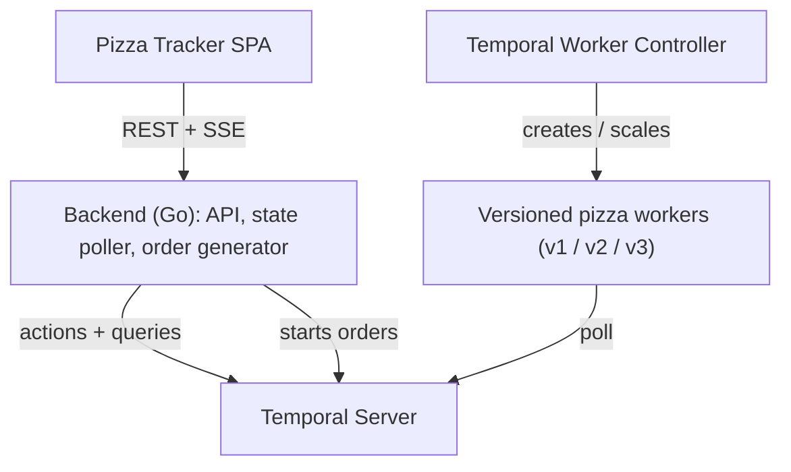

# temporal-versioning-demo

A customer-facing demo of Temporal **Worker Versioning** on
Kubernetes. A live **Pizza Tracker** dashboard shows pizza
orders flowing through their stages, colour-coded by the
worker version handling them — making safe worker deploys
visible: in-flight orders stay pinned, new orders ramp onto
the new version, and a bad release is rolled back and
recovered with zero non-determinism errors.

[][ci]
[](LICENSE)

[ci]: https://github.com/alexandreroman/temporal-versioning-demo/actions

> [!NOTE]
> 🚧 Under active development. The project structure and
> design are in place; implementation is in progress.

> [!WARNING]
> This project is for **demonstration, testing and
> development** only. It is not production-ready.

## Features

- **Pinned in-flight workflows** — orders keep running on the
  worker version they started on; deploys never break them.
- **Canary ramping** — shift a percentage of new orders onto
  a new version (10% → 50% → 100%) straight from the UI.
- **Instant rollback** — drop a bad version's traffic in one
  click; the blast radius stays capped at the canary slice.
- **Reset-with-move recovery** — rewind the orders stuck on a
  bad build and re-run them on the healthy version.
- **Live dashboard** — a responsive Pizza Tracker that paints
  each order's progress and the worker version executing it.

## Prerequisites

- A running [temporal-k8s](https://github.com/alexandreroman/temporal-k8s)
  Kind cluster (Temporal Server + Temporal Worker Controller).
- [Go](https://go.dev/) 1.26+
- [Task](https://taskfile.dev/)
- [kubectl](https://kubernetes.io/docs/tasks/tools/) and
  [Docker](https://www.docker.com/)

## Getting Started

```bash
git clone https://github.com/alexandreroman/temporal-versioning-demo.git
cd temporal-versioning-demo

task build   # build the worker and backend binaries
task test    # run the tests
```

Run the components locally against a Temporal frontend (for
example the one exposed by `temporal-k8s`):

```bash
TEMPORAL_ADDRESS=temporal.127-0-0-1.nip.io:7233 task run-worker
task run-backend   # serves the Pizza Tracker on http://localhost:8080
```

Deploy to the cluster (images are pulled from ghcr.io):

```bash
kubectl apply -k k8s/
```

## Usage

The Pizza Tracker dashboard drives the demo:

- **Ramp / Promote** a new worker version onto live traffic.
- **Rollback** to stop sending new orders to a bad version.
- **Recover stuck orders** to reset the affected orders and
  move them to the healthy version.

Shipping new worker code goes through Kubernetes (change the
image tag in the `TemporalWorkerDeployment`); traffic routing
is driven from the UI via the Temporal API.

## Configuration

| Variable                    | Description                          | Default          |
| --------------------------- | ------------------------------------ | ---------------- |
| `TEMPORAL_ADDRESS`          | Temporal frontend gRPC address       | `localhost:7233` |
| `TEMPORAL_DEPLOYMENT_NAME`  | Worker Deployment name (injected)    | (from controller)|
| `TEMPORAL_WORKER_BUILD_ID`  | Worker build ID (injected)           | (from controller)|
| `PIZZA_TASK_QUEUE`          | Task queue polled by the worker      | `pizza`          |
| `PORT`                      | Backend HTTP listen port             | `8080`           |
| `FRONTEND_DIR`              | Directory served as the SPA          | `frontend`       |

## Architecture



| Module          | Description                                       |
| --------------- | ------------------------------------------------- |
| `cmd/worker`    | Versioned Temporal worker (Pinned behavior).      |
| `cmd/backend`   | REST + SSE API, state poller and rollout actions. |
| `internal/pizza`| Pizza workflow, activities and shared types.      |
| `frontend`      | Single-page Pizza Tracker dashboard.              |
| `k8s`           | Kustomize manifests for the demo deployment.      |

## License

This project is licensed under the Apache-2.0 License — see
[LICENSE](LICENSE) for details.
